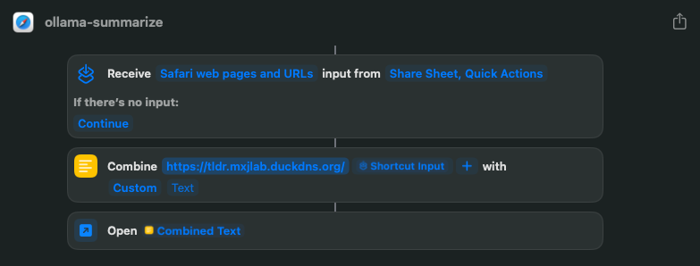

# tldr

This application provides a simple way to summarize web content using Ollama. It fetches the content of a given URL, sends it to an AI model managed by a local instance of Ollama for summarization, and returns the result in a readable format.


## Features

- Fetches web content from a given URL
- Summarizes the content using Ollama AI
- Returns the summary in Markdown format
- Can be run as a Docker container
- Integrates with Apple Shortcuts for easy mobile use

## Setup and Installation

### Prerequisites

- Docker and Docker Compose
- (Optional) An iOS device for Apple Shortcuts integration

### Docker Setup

1. Clone this repository:
   ```
   git clone https://github.com/yourusername/web-content-summarizer.git
   cd web-content-summarizer
   ```

2. Build and run the Docker containers:
   ```
   docker-compose up --build
   ```

This will start two services:
- The summarizer app on port 5000
- Ollama AI service on port 11434

### Usage

Once the application is running, you can summarize web content by sending a GET request to:

```
http://localhost:5000/<url-to-summarize>
```

Replace `<url-to-summarize>` with the URL of the web page you want to summarize.

## Apple Shortcuts Integration

Get the shortcut [here](https://www.icloud.com/shortcuts/a5c552ad101d4c828be7b0b11e6914a5).

You can create an Apple Shortcut to easily use this summarizer on your iOS device. Here's how to set it up:

1. Open the Shortcuts app on your iOS device.
2. Create a new shortcut and name it ex: "ollama-summarize".
3. Add the following actions:
   - "Receive" action: Set it to receive Safari web pages and URLs from Share Sheet and Quick Actions.
   - "Combine Text" action:
     - First input: Your server URL (e.g., "https://tldr.mxjlab.duckdns.org/")
     - Second input: Shortcut Input
   - "Open URLs" action: Use the Combined Text from the previous step.

To use the shortcut:
1. While browsing a web page in Safari, tap the Share button.
2. Select your "ollama-summarize" shortcut from the share sheet.
3. The shortcut will send the URL to your summarizer app and open the result in a new browser tab.

Note: Replace "https://tldr.mxjlab.duckdns.org/" with the actual URL where your summarizer app is hosted.



## Important Notes

- Ensure that your server is accessible from your iOS device.
- For security reasons, it's recommended to use HTTPS and implement proper authentication for production use.
- The summarization quality depends on the Ollama AI model used.

## Troubleshooting

If you encounter any issues:
1. Ensure Docker containers are running correctly.
2. Check that the URL you're trying to summarize is accessible.
3. Verify that your iOS device can reach the server running the Docker containers.

## Contributing

Contributions to improve the application are welcome. Please feel free to submit issues and pull requests.
