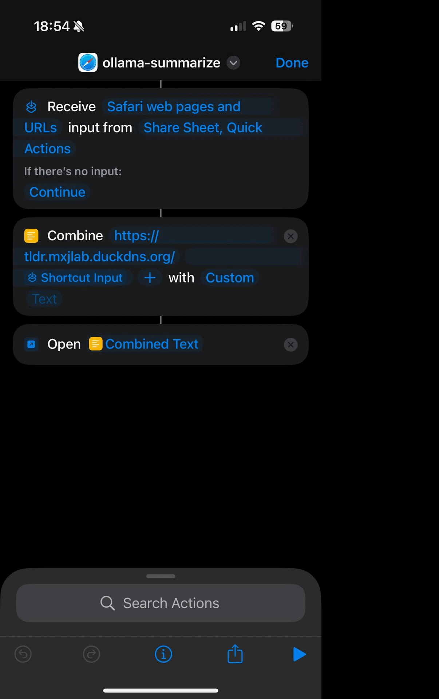
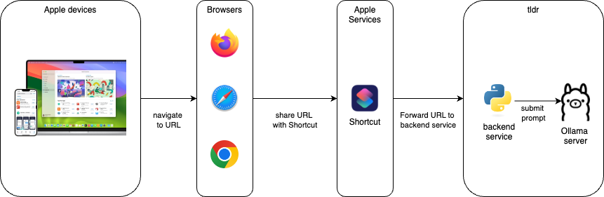
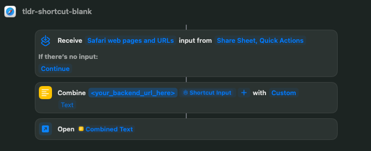

# tldr

This application provides a simple way to summarize web content on Apple devices using Ollama as the backend. The Apple Shortcut fetches the URL and submits it to the application. The python application scraps the content of a received URL, sends it to an AI model managed by a local instance of Ollama for summarization, and returns the result in a readable format.



## Features

- Fetches web content from a given URL
- Summarizes the content using Ollama AI
- Returns the summary in Markdown format
- Can be run as a Docker container
- Integrates with Apple Shortcuts for easy mobile use
- Works with any browser on any Apple device

## High level diagram



This workflow diagram illustrates the process of using Apple devices to interact with tldr. Here's a step-by-step description:

1. Apple Devices: The process starts with Apple devices.
2. Browsers: From these devices, users navigate to a URL using any browsers.
3. Apple Services: The URL is then shared with Apple's Shortcuts app.
4. Backend Service: The Shortcuts app forwards the URL to tldr backend service.
5. AI Model: Finally, the backend service submits a prompt to Ollama.

## Setup and Installation

### Prerequisites

- [Ollama server](https://ollama.com/) and [llama3.2:1b](https://ollama.com/library/llama3.2:1b) pre-installed and ready to serve (the model and service URL is modifiable, see line 24 and 28 of [summarizer_app.py](https://github.com/maciejjedrzejczyk/tldr/blob/main/summarizer_app.py).)
- Docker and Docker Compose
- An Apple device with Apple Shortcut

### Docker Setup

1. Clone this repository:
   ```
   git clone https://github.com/yourusername/web-content-summarizer.git
   cd web-content-summarizer
   ```

2. Build and run the Docker containers:
   ```
   docker-compose up --build
   ```

This will start two services:
- The summarizer app on port 5000
- Ollama AI service on port 11434

### Usage

Once the application is running, you can summarize web content by sending a GET request to:

```
http://localhost:5000/<url-to-summarize>
```

Replace `<url-to-summarize>` with the URL of the web page you want to summarize.

## Apple Shortcuts Integration

Get the shortcut [here](https://www.icloud.com/shortcuts/08394cee00724922ad1719b2f643b4f6). Open it on your Apple device and modify the backend URL (<your_backend_url_here> field) for your local instance of _tldr_. Alternatively, you can create an Apple Shortcut from scratch. Here's how to set it up:

1. Open the Shortcuts app on your Apple device.
2. Create a new shortcut and name it ex: "tldr-shortcut".
3. Add the following actions:
   - "Receive" action: Set it to receive Safari web pages and URLs from Share Sheet and Quick Actions.
   - "Combine Text" action:
     - First input: Your server URL
     - Second input: Shortcut Input
   - "Open URLs" action: Use the Combined Text from the previous step.
  


To use the shortcut:
1. While browsing a web page on your browser, tap the Share button.
2. Select your shortcut from the share sheet.
3. The shortcut will send the URL to your backend and open the result in a new browser tab.

## Important Notes

- Some websites have policies against content scraping and may prevent the app from processing request.
- Ensure that your server is accessible from your Apple device.
- For security reasons, it's recommended to use HTTPS and implement proper authentication for production use.
- The summarization quality depends on the Ollama AI model used.

## Troubleshooting

If you encounter any issues:
1. Ensure Docker containers and Ollama server are running correctly.
2. Check that the URL you're trying to summarize is accessible.
3. Verify that your Apple device can reach the server running the Docker containers.

## Contributing

Contributions to improve the application are welcome. Please feel free to submit issues and pull requests.
